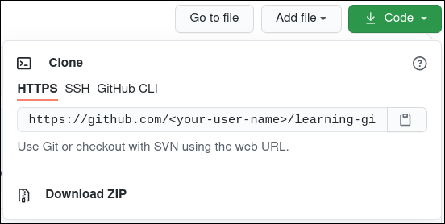
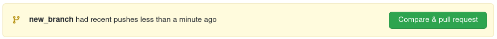

# Learning Git Version Control System

Repository for learning git and github collaboratively.

[](https://jarednielsen.com/learn-git-fork-pull-request/)

---

This repository can be used to practice the
git [forking workflow](https://www.atlassian.com/git/tutorials/comparing-workflows/forking-workflow)
with github.com.

Here are the steps:

1. Fork the repository. This can be done using the top right button on
   github.com on
    ```
    https://github.com/uwhackweek/learning-git
    ```

   

   Choose your user account in the dialog and it will create
   a [fork](https://docs.github.com/en/github/getting-started-with-github/quickstart/github-glossary#fork)
   under your GitHub user account.

1. Go to your user page on github.com, get the URL, and clone the repository
   locally.
   
   For this, you can use a button on the GitHub user interface to copy the URL.

   

   The below command has `<your-user-name>` as a sample placeholder. This
   should be replaced by your actual GitHub username.

    ```shell
    git clone https://github.com/<your-user-name>/learning-git.git
    ```

1. Once inside the newly cloned repository, add `UWhackweek` as the original source
   for your forked repository 
   
   This is step is considered adding a 
   [remote](https://docs.github.com/en/github/getting-started-with-github/quickstart/github-glossary#remote)
   to a repository.

   ```shell
    # Change to the directory
    cd learning-git
    # Add a new remote with the name 'UWhackweek' as the original fork source
    git remote add UWhackweek https://github.com/uwhackweek/learning-git.git
    ```

1. Verify that the remote was added successfully 
   
   List all remotes

   ```shell
   git remote -v
   ```

   The remote with the name `origin` is the default chosen name by git when you
   cloned the repository. This will always point to the URL of the one used in
   the `clone` command. 
   
   In our case it is:

   ```shell
   UWhackweek	https://github.com/uwhackweek/learning-git.git (fetch)
   UWhackweek	https://github.com/uwhackweek/learning-git.git (push)
   origin	https://github.com/<your-user-name>/learning-git.git (fetch)
   origin	https://github.com/<your-user-name>/learning-git.git (push)
   ```

1. Make a new branch

   ```shell
   # The '-b' is indicating a new branch with the name `new_branch`
   # It will also change to that.
   git checkout -b new_branch
   ```

   Output:
   ```shell
   Switched to a new branch 'new_branch'
   ```

1. Verify you are on the new branch

    ```shell
    # Show all branches of the repository, the current active has the `*`
    git branch
    ```

   Output:
    ```shell
    main
    * new_branch
    ```

1. Make changes within the new branch

   With this practice repository, you have to create a folder within
   **`contributions`** folder with your github username as the folder name. Use
   a new markdwon file (`.md`) or text file (`.txt`) file to practice git with.
   No other file types or folders are allowed outside your designated folder
   with this practice run.

1. Commit the changes

   ```shell
   # Add the new files
   git add .
   # Commit the changes
   git commit -m "My new files"
   ```

1. Push the changes to your forked repository

   ```shell
   git push origin new_branch
   ```

1. Create a pull request from your new branch
   
   Go to your user page on github.com. There, you will see a banner to create
   the pull request.
   
   

1. Go to the pull request tab on the UW Hackweek website and celebrate!
   
   ```shell
    https://github.com/uwhackweek/learning-git/pulls
    ```

## Keeping up to date with changes to the source (origin)

By forking the repository, you created a snapshot at that point in time of
the `learning-git` repository. To get any changes from  the UW Hackweek repository 
copied into your version, you need to issue a pull command.

Here the steps:

1. Inside your forked repository
   
   The first command queries for all changes to the `main` branch on UW Hackweek.
   You added the `UWhackweek` remote in step number 3 above.
   ```shell
   git fetch UWhackweek
   ```
   Sample output:
   ```shell
   remote: Enumerating objects: 1, done.
   remote: Counting objects: 100% (1/1), done.
   remote: Total 1 (delta 0), reused 0 (delta 0), pack-reused 0
   Unpacking objects: 100% (1/1), 623 bytes | 623.00 KiB/s, done.
   From github.com:uwhackweek/learning-git
      03a9288..64e856e  main       -> UWhackweek/main

   ```

1. Go back to the `main` branch in your fork
   
   ```shell
   git checkout main
   ```

1. Transfer all the changes
   
   This will transfer all the changes since your fork command from the UW Hackweek
   main branch to your version of the main branch, making it up to date.

   ```shell
   git pull UWhackweek main
   ```

   Sample output:
   ```shell
   From github.com:uwhackweek/learning-git
   * branch            main       -> FETCH_HEAD
   Successfully mreged and updated refs/heads/main.
   ```

---

## Resources

- [Git cheat sheet](https://training.github.com/downloads/github-git-cheat-sheet.pdf)
    
